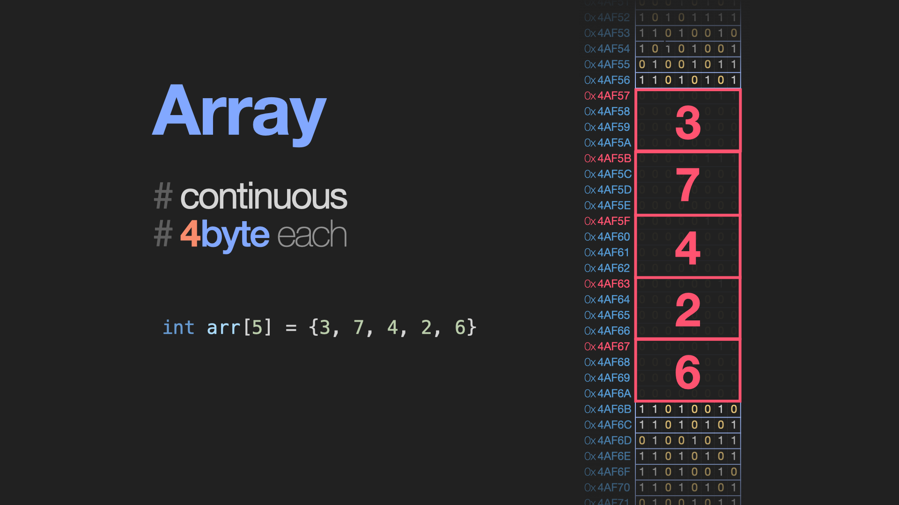

## 1. 리스트(List)

리스트는 순서를 가지고 원소를 저장하는 자료구조입니다.

- sequence 라고도 불립니다.
- 파이썬에서 사용하는 `list` 는 `Array List`로 구현되었습니다.

## 2. Array List

배열은 선언 시에 size를 정하여 해당 size 만큼의 연속된 메모리를 할당받아 data를 연속적, 순차적으로 저장하는 자료구조입니다.

- 고정된 저장공간(fixed-size)
- 순차적인 데이터 저장(order)



```python
//int 형 데이터(4byte) 5를 저장할 메모리 공간인 20byte를 미리 할당받습니다
//이 때문에 static array라고 부르기도 합니다.
int arr[5] = {3, 7, 4, 2, 6}
```

## 3. Random access

배열 변수는 자신이 할당 받은 메모리의 첫번째 주소값을 가리킵니다. 이를 direct access 또는 random access라고 부릅니다.

(Example) 첫 번째 데이터가 저장된 주소값이 0x4AF55라면 2번 째 데이터는 0x4AF55 + 4*1(byte)에 저장되어 있겠죠. 3번 째 데이터는 0x4AF55 + 4*2(byte)에 저장되어 있을 것이고, n번 째 데이터는 0x4AF55 + 4\*(n-1)에 저장되어 있을 겁니다. 아무리 긴 배열이더라도 한번의 연산으로 원하는 데이터에 바로 접근할 수 있습니다. 즉 **O(1)의 시간복잡도를 갖습니다.**
